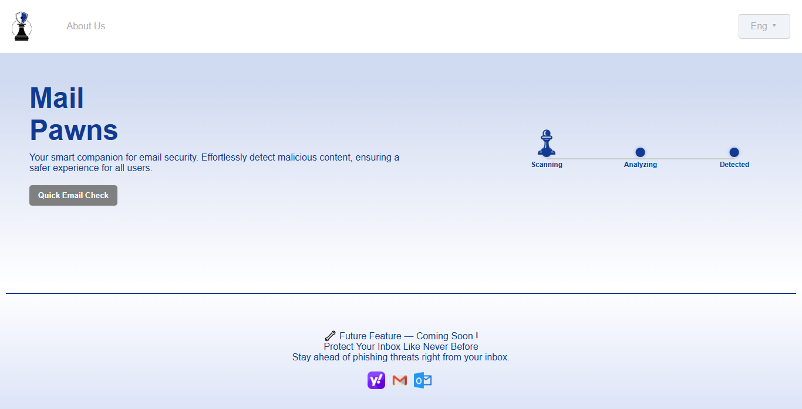
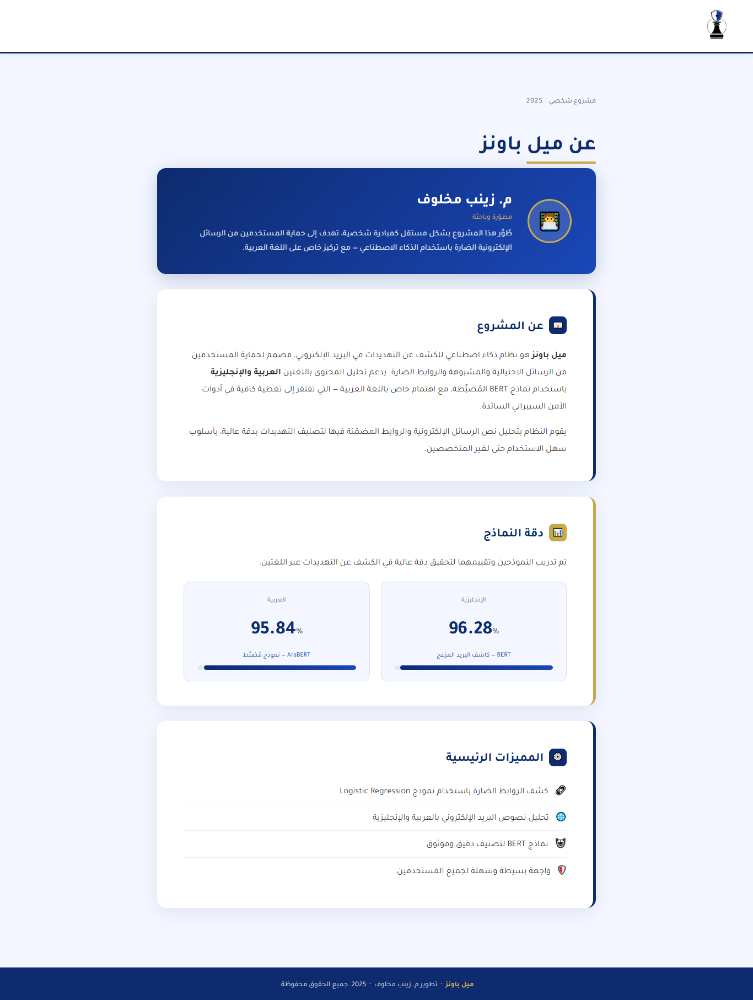
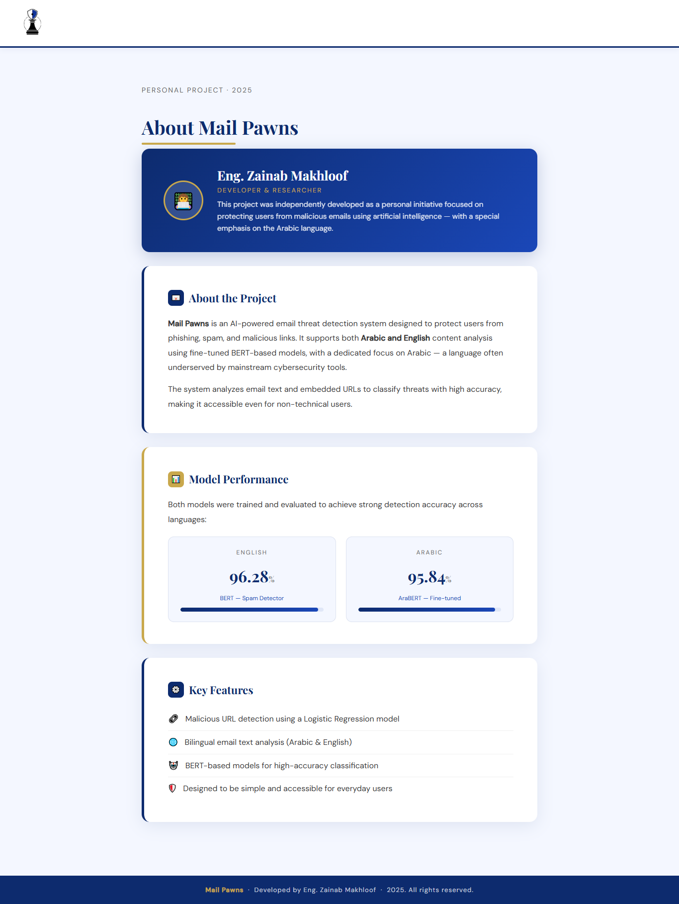
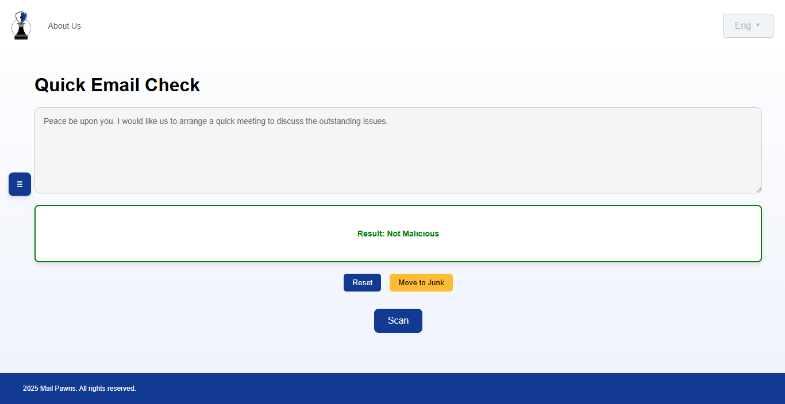
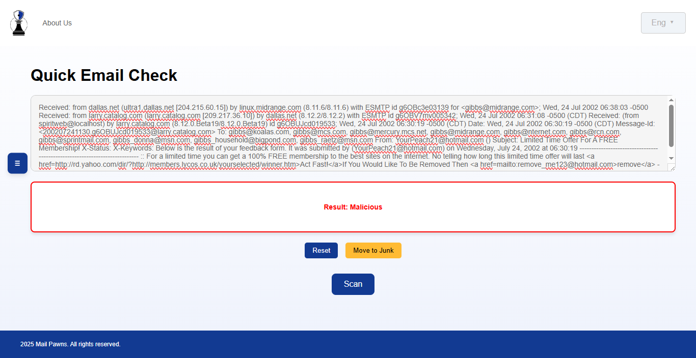
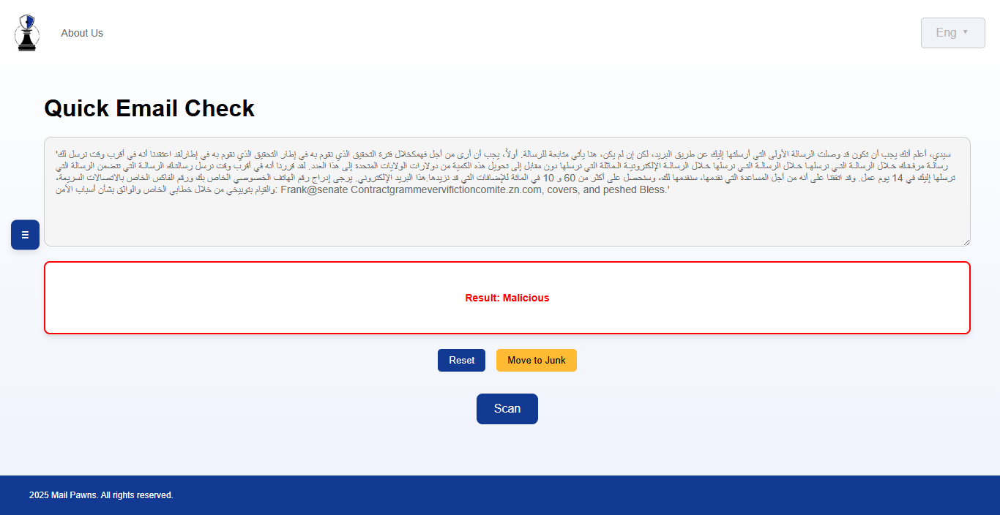

# 📧 Mail Pawns — AI-Powered Email Threat Detection

> **Personal Project** | Developed by **Eng. Zainab Makhloof** | 2025

---

## 📌 Overview

**Mail Pawns** is an intelligent email security system that detects phishing, spam, and malicious links using artificial intelligence. It supports both **Arabic and English** email analysis, with a dedicated focus on the Arabic language — a critical gap in most cybersecurity tools today.

The system analyzes email text content and embedded URLs to classify threats with high accuracy, presented through a clean, user-friendly web interface.

---

## 🧠 Models & Accuracy

| Language | Model | Accuracy |
|----------|-------|----------|
| 🇸🇦 Arabic | AraBERT (Fine-tuned) | **95.84%** |
| 🇺🇸 English | BERT — Spam Detector | **96.28%** |
| 🔗 URL Detection | Logistic Regression | — |

---
## 🖼️ Page screen

### Home page


### Arabic Aboutus


### English Aboutus


## 🖼️ Results Preview

### ✅ English — Safe Email
> Email content classified as **Not Malicious**



---

### 🚨 English — Malicious Email
> Email content classified as **Malicious**



---

### ✅ Arabic — Safe Email (بريد آمن)
> تم تصنيف المحتوى على أنه **غير ضار**


---

### 🚨 Arabic — Malicious Email (بريد ضار)
> تم تصنيف المحتوى على أنه **ضار**



---

## ⚙️ Features

- 🔗 **URL Analysis** — Detects malicious links using a trained Logistic Regression classifier
- 🌐 **Bilingual Support** — Full Arabic and English email analysis
- 🤖 **BERT-based Classification** — High-accuracy threat detection using fine-tuned transformer models
- 🛡️ **User-Friendly** — Simple interface accessible to non-technical users
- 🔍 **Auto Language Detection** — Automatically identifies the email language

---

## 🗂️ Project Structure

```
MailPwans/
├── app/
│   ├── main.py                    # App entry point
│   ├── config.py                  # Configuration & settings
│   ├── models/
│   │   └── prediction_models.py   # Model loading (AraBERT, BERT, LR)
│   ├── services/
│   │   ├── prediction_service.py  # Core prediction logic
│   │   └── data_service.py
│   ├── routes/
│   │   ├── api_routes.py          # API endpoints
│   │   └── page_routes.py         # Page routing
│   ├── utils/
│   │   └── url_utils.py           # URL feature extraction
│   └── templates/                 # HTML pages (EN + AR)
├── requirements.txt
└── README.md
```

---

## 🚀 Running the Project

### 1. Install Dependencies

```bash
pip install -r requirements.txt
```

### 2. Run on Google Colab

```python
!pip install -r requirements.txt
!python app/main.py
```

### 3. Run Locally

```bash
cd app
python main.py
```

---

## 🛠️ Tech Stack

| Component | Technology |
|-----------|-----------|
| Backend | FastAPI + Python |
| Arabic NLP | AraBERT (TensorFlow) |
| English NLP | BERT — Spam Detector (PyTorch) |
| URL Detection | Logistic Regression (scikit-learn) |
| Language Detection | langdetect |
| URL Extraction | OpenRouter API (LLaMA 4) |
| Frontend | HTML / CSS (Bilingual AR+EN) |

---

## 👩‍💻 Developer

**Eng. Zainab Makhloof**  
Personal Independent Project — 2025

---

*Mail Pawns — Making email safer for Arabic and English speakers alike.*
